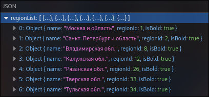
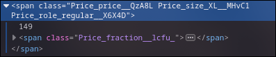

# Тестовый парсер

Run `npm i` to install dependencies

```bash
npm i
```

You can run script with your values like that:

```bash
node index.js [link] [region] [id](optional)
```

example:

```bash
node index.js https://www.vprok.ru/product/domik-v-derevne-dom-v-der-moloko-ster-3-2-950g--309202 "Санкт-Петербург и область"
```

Or run script.sh to run several scripts:

```bash
bash script.sh
```

## Results

Results of running script.sh are zipped in separed archives in `results` folder.

## Config

Data about regions and selectors for product info are stored in `config.json` so you can quickly change it if needed.
That config is based on data found while inspecting DOM and Network of product page.


